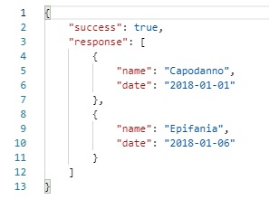
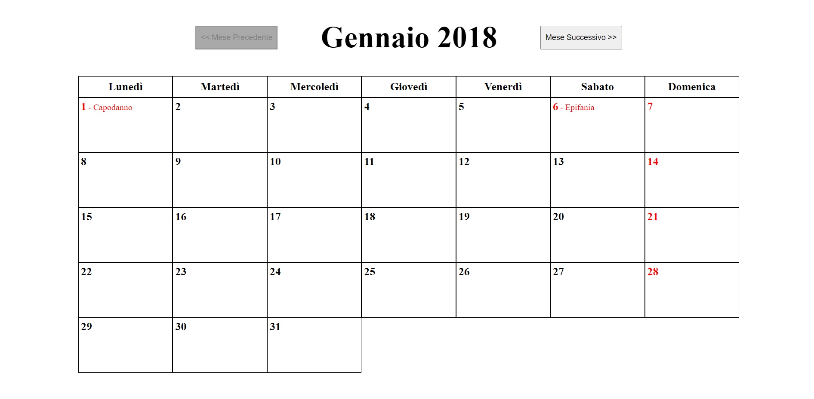

# Ajax-ex-calendar
This is a holiday calendar of 2018.  

The website generates the days of the month thanks to MomentJS and Handlebars and
with an ajax request the holidays are added.

The API only has the holidays for the year 2018 so the calendar is just of 2018.

If a day of the month is a holiday or it's sunday the number is colored in red.

The dates of the month are managed with MomentJS.
Handlebars has been used to create the squares.
Mobile, Tablet and Desktop version availables.

HTML, CSS, JavaScript, jQuery, MomentJS, Handlebars.
***
### [Live Website](https://gianluigivitale.github.io/ajax-ex-calendar/)
***
### Preview-api:

### Preview-lg:

### Preview-xs:

